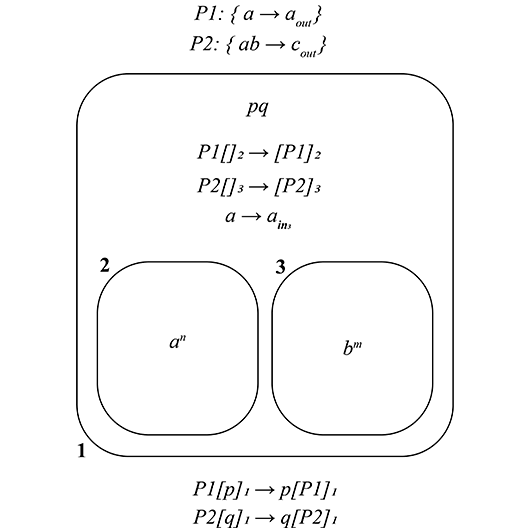
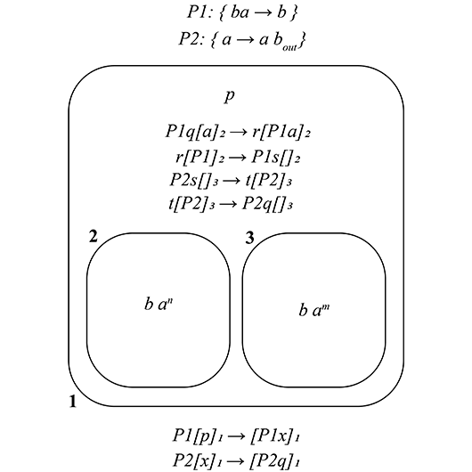

# PSystem python library

Library that allows you to create P Systems and evolve them.
## PSystem class and its functions

### How to create a PSystem object?

ps = PSystem(H, V, base_struct, m_objects, m_plasmids, m_rules, p_rules, i0)

| Parameter | Type     | Description                |
| :-------- | :------- | :------------------------- |
| `H` | `dict` | Plasmids' alphabet and its rules. Defaults to { } |
| `V` | `list` | System's alphabet. Defaults to [ ] |
| `base_struct` | `str` | Initial system's structure. Defaults to "11" |
| `m_objects` | `dict` | Membrane's objects. Defaults to { 1 : '' } |
| `m_plasmids` | `dict` | Membranes' plasmids. Defaults to None |
| `m_rules` | `dict` | Membrane's rules. Defaults to { 1 : { } } |
| `p_rules` | `dict` | Rules priority in each membrane. Defaults to { 1: [ ] }|
| `i0` | `int` | Output membrane. Defaults to 1 |

### ps.steps(*n*, *verbose* = False)
Evolve the system _n_ steps. If verbose is True, prints system's structure in each step.

### ps.while_evolve(*verbose* = False)
Evolve the system until finish all possible iterations. If verbose is True, prints system's structure in each step.

### ps.evolve(*feasible_rules*, *verbose* = False)
Evolve the system choosing a random membrane from feasible_rules list whose items are a tuple of membrane's id and their rules to apply. If verbose is True, prints the membrane where the rules are being applied, the rules applied and the number of times each rule has been applied.

### ps.get_fesible_rules()
Get feasible rules from all the membranes in the current state.

### ps.get_memb_feasible_rules(*memb_id* )
Get a combination of rules that can be applied all at once in the membrane with id *memb_id*.

### ps.accessible_plasmids(*memb_id* )
Get the plasmids that could go into the membrane with id *memb_id*.

### ps.print_system()
Print system's structure.

## Membrane class and its functions

### How to create a membrane

memb = Membrane(V, id, parent, objects, plasmids, rules, p_rules)

| Parameter | Type     | Description                |
| :-------- | :------- | :------------------------- |
| `V` | `list` | Membrane's alphabet (same as system's) |
| `id` | `int` | Membrane's id |
| `parent` | `int` | Parent Membrane's id. Defaults to None |
| `objects` | `str` | Membrane's objects. Defaults to '' |
| `plasmids` | `list` | Membrane's plasmids. Default to [ ]. |
| `rules` | `dict` | Membrane's rules. Defaults to {} |
| `p_rules` | `dict` | Rules priority in membrane. Defaults to {} |

### memb.add_child(*child_id* )
Add child with id *child_id* to the membrane *memb*.

### memb.remove_child(*child_id* )
Remove child  with id *child_id* from the membrane *memb*.

### memb.add_objects(*objects* )
Add all the objects in *objects:string* to the membrane *memb*


## Examples without plasmids

### _n_ squared

A **P** System generating _n²_, _n_ >= 1


```python
from libPS.PSystem import *

alphabet = ['a','b','x','c','f']
struct = '12334421'
m_objects = {
    3:'af',
}

r_2 = {
    1:('x','b'),
    2:('b','bc4'),
    3:('ff','f'),
    4:('f','a.')
}

r_3 = {
    1:('a','ax'),
    2:('a','x.'),
    3:('f','ff')
}

m_rules = {
    2:r_2,
    3:r_3,
}

p_rules = {
    2:[(3,4)],
}

i0 = 4

ps = PSystem(V=alphabet, base_struct=struct, m_objects=m_objects, m_rules=m_rules, p_rules=p_rules, i0=i0)

ps.while_evolve(verbose=True)
```

#### Output
```terminal

[1 '' [2 '' [3 'fa' ]3[4 '' ]4]2]1

--------------------------------------------------------------------------------------------

memb_id: 3 | n_times: 1 -> rule '3':  ('f', 'ff')
memb_id: 3 | n_times: 1 -> rule '1':  ('a', 'ax')
[1 '' [2 '' [3 'xffa' ]3[4 '' ]4]2]1

--------------------------------------------------------------------------------------------

memb_id: 3 | n_times: 2 -> rule '3':  ('f', 'ff')
memb_id: 3 | n_times: 1 -> rule '1':  ('a', 'ax')
[1 '' [2 '' [3 'xxffffa' ]3[4 '' ]4]2]1

--------------------------------------------------------------------------------------------

memb_id: 3 | n_times: 4 -> rule '3':  ('f', 'ff')
memb_id: 3 | n_times: 1 -> rule '1':  ('a', 'ax')
[1 '' [2 '' [3 'xxxffffffffa' ]3[4 '' ]4]2]1

--------------------------------------------------------------------------------------------

memb_id: 3 | n_times: 8 -> rule '3':  ('f', 'ff')
memb_id: 3 | n_times: 1 -> rule '1':  ('a', 'ax')
[1 '' [2 '' [3 'xxxxffffffffffffffffa' ]3[4 '' ]4]2]1

--------------------------------------------------------------------------------------------

memb_id: 3 | n_times: 16 -> rule '3':  ('f', 'ff')
memb_id: 3 | n_times: 1 -> rule '1':  ('a', 'ax')
[1 '' [2 '' [3 'xxxxxffffffffffffffffffffffffffffffffa' ]3[4 '' ]4]2]1

--------------------------------------------------------------------------------------------

memb_id: 3 | n_times: 32 -> rule '3':  ('f', 'ff')
memb_id: 3 | n_times: 1 -> rule '1':  ('a', 'ax')
[1 '' [2 '' [3 'xxxxxxffffffffffffffffffffffffffffffffffffffffffffffffffffffffffffffffa' ]3[4 '' ]4]2]1

--------------------------------------------------------------------------------------------

memb_id: 3 | n_times: 64 -> rule '3':  ('f', 'ff')
memb_id: 3 | n_times: 1 -> rule '2':  ('a', 'x.')
[1 '' [2 'xxxxxxxffffffffffffffffffffffffffffffffffffffffffffffffffffffffffffffffffffffffffffffffffffffffffffffffffffffffffffffffffffffffffffffff' [4 '' ]4]2]1

--------------------------------------------------------------------------------------------

memb_id: 2 | n_times: 7 -> rule '1':  ('x', 'b')
memb_id: 2 | n_times: 64 -> rule '3':  ('ff', 'f')
[1 '' [2 'ffffffffffffffffffffffffffffffffffffffffffffffffffffffffffffffffbbbbbbb' [4 '' ]4]2]1

--------------------------------------------------------------------------------------------

memb_id: 2 | n_times: 7 -> rule '2':  ('b', 'bc4')
memb_id: 2 | n_times: 32 -> rule '3':  ('ff', 'f')
[1 '' [2 'ffffffffffffffffffffffffffffffffbbbbbbb' [4 'ccccccc' ]4]2]1

--------------------------------------------------------------------------------------------

memb_id: 2 | n_times: 7 -> rule '2':  ('b', 'bc4')
memb_id: 2 | n_times: 16 -> rule '3':  ('ff', 'f')
[1 '' [2 'ffffffffffffffffbbbbbbb' [4 'cccccccccccccc' ]4]2]1

--------------------------------------------------------------------------------------------

memb_id: 2 | n_times: 7 -> rule '2':  ('b', 'bc4')
memb_id: 2 | n_times: 8 -> rule '3':  ('ff', 'f')
[1 '' [2 'ffffffffbbbbbbb' [4 'ccccccccccccccccccccc' ]4]2]1

--------------------------------------------------------------------------------------------

memb_id: 2 | n_times: 7 -> rule '2':  ('b', 'bc4')
memb_id: 2 | n_times: 4 -> rule '3':  ('ff', 'f')
[1 '' [2 'ffffbbbbbbb' [4 'cccccccccccccccccccccccccccc' ]4]2]1

--------------------------------------------------------------------------------------------

memb_id: 2 | n_times: 7 -> rule '2':  ('b', 'bc4')
memb_id: 2 | n_times: 2 -> rule '3':  ('ff', 'f')
[1 '' [2 'ffbbbbbbb' [4 'ccccccccccccccccccccccccccccccccccc' ]4]2]1

--------------------------------------------------------------------------------------------

memb_id: 2 | n_times: 7 -> rule '2':  ('b', 'bc4')
memb_id: 2 | n_times: 1 -> rule '3':  ('ff', 'f')
[1 '' [2 'fbbbbbbb' [4 'cccccccccccccccccccccccccccccccccccccccccc' ]4]2]1

--------------------------------------------------------------------------------------------

memb_id: 2 | n_times: 7 -> rule '2':  ('b', 'bc4')
memb_id: 2 | n_times: 1 -> rule '4':  ('f', 'a.')
[1 'abbbbbbb' [4 'ccccccccccccccccccccccccccccccccccccccccccccccccc' ]4]1

============================================================================================

[('a', 0), ('b', 0), ('c', 49), ('f', 0), ('x', 0)]
```

### k divides n

A **P** system that checks if a number _n_ is divisible by another number _k_. 


In this case _k_ = 3 divides _n_ = 15 .

```python
from libPS.PSystem import *

n = 15
k = 3

alphabet = ['a','c','x','d']
struct = '122331'
m_objects = {
    2:'a'*n+'c'*k+'d',
    3:'a'
}

r_1 = {
    1:('dcx','a3')
}

r_2 = {
    1:('ac','x'),
    2:('ax','c'),
    3:('d','d.')
}

m_rules = {
    1:r_1,
    2:r_2,
}

p_rules = {
    2 : [(1,3),(2,3)],
}

i0 = 3
ps = PSystem(V=alphabet, base_struct=struct, m_objects=m_objects, m_rules=m_rules, p_rules=p_rules, i0=i0)

ps.while_evolve(verbose=True)
```
#### Output
```terminal

[1 '' [2 'aaaaaaaaaaaaaaadccc' ]2[3 'a' ]3]1

--------------------------------------------------------------------------------------------

memb_id: 2 | n_times: 3 -> rule '1':  ('ac', 'x')
[1 '' [2 'aaaaaaaaaaaadxxx' ]2[3 'a' ]3]1

--------------------------------------------------------------------------------------------

memb_id: 2 | n_times: 3 -> rule '2':  ('ax', 'c')
[1 '' [2 'aaaaaaaaadccc' ]2[3 'a' ]3]1

--------------------------------------------------------------------------------------------

memb_id: 2 | n_times: 3 -> rule '1':  ('ac', 'x')
[1 '' [2 'aaaaaadxxx' ]2[3 'a' ]3]1

--------------------------------------------------------------------------------------------

memb_id: 2 | n_times: 3 -> rule '2':  ('ax', 'c')
[1 '' [2 'aaadccc' ]2[3 'a' ]3]1

--------------------------------------------------------------------------------------------

memb_id: 2 | n_times: 3 -> rule '1':  ('ac', 'x')
[1 '' [2 'dxxx' ]2[3 'a' ]3]1

--------------------------------------------------------------------------------------------

memb_id: 2 | n_times: 1 -> rule '3':  ('d', 'd.')
[1 'dxxx' [3 'a' ]3]1

============================================================================================

[('a', 1), ('c', 0), ('d', 0), ('x', 0)]

```

In this other case _k_ = 4 not divides _n_ = 15.

```terminal

[1 '' [2 'ccccdaaaaaaaaaaaaaaa' ]2[3 'a' ]3]1

--------------------------------------------------------------------------------------------

memb_id: 2 | n_times: 4 -> rule '1':  ('ac', 'x')
[1 '' [2 'xxxxdaaaaaaaaaaa' ]2[3 'a' ]3]1

--------------------------------------------------------------------------------------------

memb_id: 2 | n_times: 4 -> rule '2':  ('ax', 'c')
[1 '' [2 'ccccdaaaaaaa' ]2[3 'a' ]3]1

--------------------------------------------------------------------------------------------

memb_id: 2 | n_times: 4 -> rule '1':  ('ac', 'x')
[1 '' [2 'xxxxdaaa' ]2[3 'a' ]3]1

--------------------------------------------------------------------------------------------

memb_id: 2 | n_times: 3 -> rule '2':  ('ax', 'c')
[1 '' [2 'cccxd' ]2[3 'a' ]3]1

--------------------------------------------------------------------------------------------

memb_id: 2 | n_times: 1 -> rule '3':  ('d', 'd.')
[1 'cccxd' [3 'a' ]3]1

--------------------------------------------------------------------------------------------

memb_id: 1 | n_times: 1 -> rule '1':  ('dcx', 'a3')
[1 'cc' [3 'aa' ]3]1

============================================================================================

[('a', 2), ('c', 0), ('d', 0), ('x', 0)]

```

## Examples with plasmids

### Arithmetic substraction. *m* - *n*

A **P** System that makes an arithmetic substraction operation between *m* and *n*.



```python
from libPS.PSystem import *

n = 4
m = 10

alphabet = ['a','b','c','p','q']
plasmids = {
    "P1":{"P11":('a','a0')} ,
    "P2":{"P21":('ab','c0')}
}
struct = '122331'
m_objects = {
    1:'pq',
    2:'a'*n,
    3:'b'*m
}

m_plasmids = {
    0: set(['P1','P2'])
}

r_0 = {
    1:("P1[p]1","p[P1]1"),
    2:("P2[q]1","q[P2]1"),
}

r_1 = {
    1:("P1[]2","[P1]2"),
    2:("P2[]3","[P2]3"),
    3:("a","a3"),
}

m_rules = {
    0:r_0,
    1:r_1,
}

i0 = 3
ps = PSystem(H=plasmids, V=alphabet, base_struct=struct, m_objects=m_objects, m_plasmids=m_plasmids, m_rules=m_rules, i0=i0)

ps.while_evolve(verbose=True)
```
#### Output
```terminal

 'P1P2' ''  [1 '' 'pq'  [2 '' 'aaaa' ]2 [3 '' 'bbbbbbbbbb' ]3]1

--------------------------------------------------------------------------------------------

memb_id: 0 | n_times: 1 -> rule '1':  ('P1[p]1', 'p[P1]1')
 'P2' 'p'  [1 'P1' 'q'  [2 '' 'aaaa' ]2 [3 '' 'bbbbbbbbbb' ]3]1

--------------------------------------------------------------------------------------------

memb_id: 0 | n_times: 1 -> rule '2':  ('P2[q]1', 'q[P2]1')
memb_id: 1 | n_times: 1 -> rule '1':  ('P1[]2', '[P1]2')
 '' 'pq'  [1 'P2' ''  [2 'P1' 'aaaa' ]2 [3 '' 'bbbbbbbbbb' ]3]1

--------------------------------------------------------------------------------------------

memb_id: 1 | n_times: 1 -> rule '2':  ('P2[]3', '[P2]3')
memb_id: 2 | n_times: 4 -> rule 'P11':  ('a', 'a0')
 '' 'pq'  [1 '' 'aaaa'  [2 'P1' '' ]2 [3 'P2' 'bbbbbbbbbb' ]3]1

--------------------------------------------------------------------------------------------

memb_id: 1 | n_times: 4 -> rule '3':  ('a', 'a3')
 '' 'pq'  [1 '' ''  [2 'P1' '' ]2 [3 'P2' 'aaaabbbbbbbbbb' ]3]1

--------------------------------------------------------------------------------------------

memb_id: 3 | n_times: 4 -> rule 'P21':  ('ab', 'c0')
 '' 'pq'  [1 '' 'cccc'  [2 'P1' '' ]2 [3 'P2' 'bbbbbb' ]3]1

============================================================================================

[('a', 0), ('b', 6), ('c', 0), ('p', 0), ('q', 0)]
```

### Mathematic product. *m* * *n*

A **P** System that makes product operation between *m* and *n*.




```python
from libPS.PSystem import *

n = 4
m = 5

alphabet = ['a','b','p','x','q','r','t','s']
plasmids = {
    "P1":{"P11":('ba','b')},
    "P2":{"P21":('a',"ab0")},
}
struct = '122331'
m_objects = {
    1:'p',
    2:'b' + 'a'*n,
    3:'b' + 'a'*m,
}

m_plasmids = {
    0: set(['P1','P2']),
}

r_0 = {
    1:("P1[p]1","[P1x]1"),
    2:("P2[x]1","[P2q]1"),
}

r_1 = {
    1:("P1q[a]2","r[P1a]2"),
    2:("r[P1]2","P1s[]2"),
    3:("P2s[]3","t[P2]3"),
    4:("t[P2]3","P2q[]3"),
}

m_rules = {
    0:r_0,
    1:r_1,
}

i0 = 1
ps = PSystem(H=plasmids, V=alphabet, base_struct=struct, m_objects=m_objects, m_plasmids=m_plasmids, m_rules=m_rules, i0=i0)

ps.while_evolve(verbose=True)
```

#### Output
```terminal

 'P1P2' ''  [1 '' 'p'  [2 '' 'aaaab' ]2 [3 '' 'aaaaab' ]3]1

--------------------------------------------------------------------------------------------

memb_id: 0 | n_times: 1 -> rule '1':  ('P1[p]1', '[P1x]1')
 'P2' ''  [1 'P1' 'x'  [2 '' 'aaaab' ]2 [3 '' 'aaaaab' ]3]1

--------------------------------------------------------------------------------------------

memb_id: 0 | n_times: 1 -> rule '2':  ('P2[x]1', '[P2q]1')
 '' ''  [1 'P1P2' 'q'  [2 '' 'aaaab' ]2 [3 '' 'aaaaab' ]3]1

--------------------------------------------------------------------------------------------

memb_id: 1 | n_times: 1 -> rule '1':  ('P1q[a]2', 'r[P1a]2')
 'P1' ''  [1 'P2' 'r'  [2 'P1' 'aaaab' ]2 [3 '' 'aaaaab' ]3]1

--------------------------------------------------------------------------------------------

memb_id: 1 | n_times: 1 -> rule '2':  ('r[P1]2', 'P1s[]2')
memb_id: 2 | n_times: 1 -> rule 'P11':  ('ba', 'b')
 '' ''  [1 'P1P2' 's'  [2 '' 'aaab' ]2 [3 '' 'aaaaab' ]3]1

--------------------------------------------------------------------------------------------

memb_id: 1 | n_times: 1 -> rule '3':  ('P2s[]3', 't[P2]3')
 'P2' ''  [1 'P1' 't'  [2 '' 'aaab' ]2 [3 'P2' 'aaaaab' ]3]1

--------------------------------------------------------------------------------------------

memb_id: 1 | n_times: 1 -> rule '4':  ('t[P2]3', 'P2q[]3')
memb_id: 3 | n_times: 5 -> rule 'P21':  ('a', 'ab0')
 '' ''  [1 'P1P2' 'bbbbbq'  [2 '' 'aaab' ]2 [3 '' 'aaaaab' ]3]1

--------------------------------------------------------------------------------------------

memb_id: 1 | n_times: 1 -> rule '1':  ('P1q[a]2', 'r[P1a]2')
 'P1' ''  [1 'P2' 'bbbbbr'  [2 'P1' 'aaab' ]2 [3 '' 'aaaaab' ]3]1

--------------------------------------------------------------------------------------------

memb_id: 1 | n_times: 1 -> rule '2':  ('r[P1]2', 'P1s[]2')
memb_id: 2 | n_times: 1 -> rule 'P11':  ('ba', 'b')
 '' ''  [1 'P1P2' 'bbbbbs'  [2 '' 'aab' ]2 [3 '' 'aaaaab' ]3]1

--------------------------------------------------------------------------------------------

memb_id: 1 | n_times: 1 -> rule '3':  ('P2s[]3', 't[P2]3')
 'P2' ''  [1 'P1' 'bbbbbt'  [2 '' 'aab' ]2 [3 'P2' 'aaaaab' ]3]1

--------------------------------------------------------------------------------------------

memb_id: 1 | n_times: 1 -> rule '4':  ('t[P2]3', 'P2q[]3')
memb_id: 3 | n_times: 5 -> rule 'P21':  ('a', 'ab0')
 '' ''  [1 'P1P2' 'bbbbbbbbbbq'  [2 '' 'aab' ]2 [3 '' 'aaaaab' ]3]1

--------------------------------------------------------------------------------------------

memb_id: 1 | n_times: 1 -> rule '1':  ('P1q[a]2', 'r[P1a]2')
 'P1' ''  [1 'P2' 'bbbbbbbbbbr'  [2 'P1' 'aab' ]2 [3 '' 'aaaaab' ]3]1

--------------------------------------------------------------------------------------------

memb_id: 1 | n_times: 1 -> rule '2':  ('r[P1]2', 'P1s[]2')
memb_id: 2 | n_times: 1 -> rule 'P11':  ('ba', 'b')
 '' ''  [1 'P1P2' 'bbbbbbbbbbs'  [2 '' 'ab' ]2 [3 '' 'aaaaab' ]3]1

--------------------------------------------------------------------------------------------

memb_id: 1 | n_times: 1 -> rule '3':  ('P2s[]3', 't[P2]3')
 'P2' ''  [1 'P1' 'bbbbbbbbbbt'  [2 '' 'ab' ]2 [3 'P2' 'aaaaab' ]3]1

--------------------------------------------------------------------------------------------

memb_id: 1 | n_times: 1 -> rule '4':  ('t[P2]3', 'P2q[]3')
memb_id: 3 | n_times: 5 -> rule 'P21':  ('a', 'ab0')
 '' ''  [1 'P1P2' 'bbbbbbbbbbbbbbbq'  [2 '' 'ab' ]2 [3 '' 'aaaaab' ]3]1

--------------------------------------------------------------------------------------------

memb_id: 1 | n_times: 1 -> rule '1':  ('P1q[a]2', 'r[P1a]2')
 'P1' ''  [1 'P2' 'bbbbbbbbbbbbbbbr'  [2 'P1' 'ab' ]2 [3 '' 'aaaaab' ]3]1

--------------------------------------------------------------------------------------------

memb_id: 1 | n_times: 1 -> rule '2':  ('r[P1]2', 'P1s[]2')
memb_id: 2 | n_times: 1 -> rule 'P11':  ('ba', 'b')
 '' ''  [1 'P1P2' 'bbbbbbbbbbbbbbbs'  [2 '' 'b' ]2 [3 '' 'aaaaab' ]3]1

--------------------------------------------------------------------------------------------

memb_id: 1 | n_times: 1 -> rule '3':  ('P2s[]3', 't[P2]3')
 'P2' ''  [1 'P1' 'bbbbbbbbbbbbbbbt'  [2 '' 'b' ]2 [3 'P2' 'aaaaab' ]3]1

--------------------------------------------------------------------------------------------

memb_id: 1 | n_times: 1 -> rule '4':  ('t[P2]3', 'P2q[]3')
memb_id: 3 | n_times: 5 -> rule 'P21':  ('a', 'ab0')
 '' ''  [1 'P1P2' 'bbbbbbbbbbbbbbbbbbbbq'  [2 '' 'b' ]2 [3 '' 'aaaaab' ]3]1

============================================================================================

[('a', 0), ('b', 20), ('p', 0), ('q', 1), ('r', 0), ('s', 0), ('t', 0), ('x', 0)]
```

## Notation

### Parameters

Using as example a **P** system deciding whether _k_ divides _n_, which was used as example of use before:

<table>
    <thead>
        <tr>
            <th>Object</th>
            <th>Parameter</th>
            <th>In code</th>
            <th>In traditional notation</th>
        </tr>
    </thead>
    <tbody>
        <tr>
            <td align="center">PSystem <br> All membs</td>
            <td align="center">alphabet</td>
            <td align="center">['a','c','x','d']</td>
            <td align="center">{a,c,c',d}</td>
        </tr>
        <tr>
            <td align="center">PSystem</td>
            <td align="center">struct</td>
            <td align="center">'122331'</td>
            <td align="center">[<sub>1</sub> [<sub>2</sub> ]<sub>2</sub> [<sub>3</sub> ]<sub>3</sub> ]<sub>1</sub></td>
        </tr>
        <tr>
            <td align="center">memb1</td>
            <td align="center">objects</td>
            <td align="center">''</td>
            <td align="center">&lambda;</td>
        </tr>
        <tr>
            <td align="center">memb2</td>
            <td align="center">objects</td>
            <td align="center">'a'*n+'c'*k+'d'</td>
            <td align="center">a<sup>n</sup>c<sup>k</sup>d</td>
        </tr>
        <tr>
            <td align="center">memb3</td>
            <td align="center">objects</td>
            <td align="center">'a'</td>
            <td align="center">a</td>
        </tr>
        <tr>
            <td align="center">memb1</td>
            <td align="center">rules</td>
            <td align="center">{ 1: ( 'dcx', 'a3' )}</td>
            <td align="center">{ dcc' &rarr; (a, in<sub>3</sub>)}</td>
        </tr>
        <tr>
            <td align="center">memb2</td>
            <td align="center">rules</td>
            <td align="center">{ 1: ( 'ac', 'x' ),<br>2: ( 'ax', 'c' ),<br>3: ( 'd', 'd.' ) }</td>
            <td align="center">{ r1: ac &rarr; c',<br>r2: ac' &rarr; c,<br>r3: d &rarr; d&delta; }</td>
        </tr>
        <tr>
            <td align="center">memb3</td>
            <td align="center">rules</td>
            <td align="center">{ }</td>
            <td align="center">&Oslash;</td>
        </tr>
        <tr>
            <td align="center">memb1</td>
            <td align="center">p_rules</td>
            <td align="center">[ ]</td>
            <td align="center">&Oslash;</td>
        </tr>
        <tr>
            <td align="center">memb2</td>
            <td align="center">p_rules</td>
            <td align="center">[ ( 1, 3 ), ( 2, 3 ) ]</td>
            <td align="center">{ r1 > r3, r2 > r3 }</td>
        </tr>
        <tr>
            <td align="center">memb3</td>
            <td align="center">p_rules</td>
            <td align="center">[ ]</td>
            <td align="center">&Oslash;</td>
        </tr>
        <tr>
            <td align="center">PSystem</td>
            <td align="center">m_rules</td>
            <td align="center">{ 1 : memb1.rules,<br>2 : memb2.rules,<br>3 : memb3.rules }</td>
            <td align="center">R<sub>1</sub>, R<sub>2</sub>, R<sub>3</sub></td>
        </tr>
        <tr>
            <td align="center">PSystem</td>
            <td align="center">p_rules</td>
            <td align="center">{ 1 : memb1.p_rules,<br>2 : memb2.p_rules,<br>3 : memb3.p_rules }</td>
            <td align="center">&rho;<sub>1</sub>, &rho;<sub>2</sub>, &rho;<sub>3</sub></td>
        </tr>
    </tbody>
</table>

### Rules

<table>
    <thead>
        <tr>
            <th>Description</th>
            <th>In code</th>
            <th>In traditional notation</th>
        </tr>
    </thead>
    <tbody>
        <tr>
            <td>Add an object to a membrane</td>
            <td align="center">Using 2 to enter to memb2 <br> ( 'a', 'ab2' )</td>
            <td align="center">Using in<sub>2</sub> to enter to memb2 <br>a &rarr; a ( b, in<sub>2</sub> )</td>
        </tr>
        <tr>
            <td>An object will exit the membrane</td>
            <td align="center">Using 0 to exit the membrane<br>( 'a', 'a0' )</td>
            <td align="center">Using out to exit the membrane<br>a &rarr; ( a, out )</td>
        </tr>
        <tr>
            <td>Remove a membrane (dissolve)</td>
            <td align="center">Using '.' to dissolve<br>( 'b', '.' )</td>
            <td align="center">Using &delta; to dissolve <br> b &rarr; &delta;</td>
        </tr>
        <tr><td colspan=3 align="center"><b>Priority</b></td></tr>
        <tr>
            <th>Description</th>
            <th>In code</th>
            <th>In traditional notation</th>
        </tr>
        <tr>
            <td>rule1 more priority than rule2</td>
            <td align="center">( 1, 2 )</td>
            <td align="center">r1 > r2</td>
        </tr>
    </tbody>
</table>

## Authors

- [Pablo García López](https://github.com/pablogl2002)