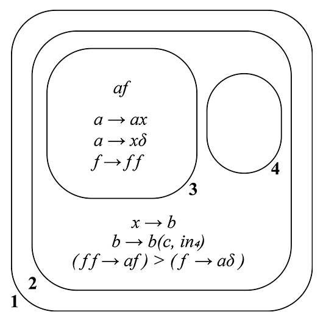

# PSystem python library

Library that allows you to create P Systems and evolve them.
## PSystem class and its functions

### How to create a PSystem object?

ps = PSystem(V, base_struct, m_objects, m_rules, p_rules, i0)

| Parameter | Type     | Description                |
| :-------- | :------- | :------------------------- |
| `V` | `list` | System's alphabet. Defaults to [] |
| `base_struct` | `str` | Initial system's structure. Defaults to "11" |
| `m_objects` | `dict` | Membrane's objects. Defaults to {} |
| `m_rules` | `dict` | Membrane's rules. Defaults to {} |
| `p_rules` | `dict` | Rules priority in each membrane. Defaults to {}|
| `i0` | `int` | Output membrane. Defaults to 1 |

### ps.steps(n, verbose=False)
Evolve the system 'n' steps. If verbose is True, prints system's structure in each step

### ps.while_evolve(verbose=False)
Evolve the system until finish all possible iterations. If verbose is True, prints system's structure in each step

### ps.evolve(feasible_rules)
Evolve the system choosing a random membrane from feasible_rules list whose items are a tuple of membrane's id and their rules to apply

### ps.get_fesible_rules()
Get feasible rules from all the membranes in the current state 

### ps.print_system()
Print system's structure

## Membrane class and its functions

### How to create a membrane

memb = Membrane(V, id, parent, objects, rules, p_rules)

| Parameter | Type     | Description                |
| :-------- | :------- | :------------------------- |
| `V` | `list` | Membrane's alphabet (same as system's) |
| `id` | `int` | Membrane's id |
| `parent` | `int` | Parent Membrane's id. Defaults to None |
| `objects` | `str` | Membrane's objects. Defaults to '' |
| `rules` | `dict` | Membrane's rules. Defaults to {} |
| `p_rules` | `dict` | Rules priority in membrane. Defaults to {} |

## memb.add_child(child_id)
Add child with id 'child_id' to the membrane 'memb'

## memb.add_plasmids(plasmids)
Add all plasmid in 'plasmids:list' to the membrane (not working, because not implemented plasmids yet)

## memb.add_objects(objects)
Add all the objects in 'objects:string' to the membrane 'memb'

## memb.get_feasible_rules()
Get a combination of rules that can be applied all at once in the membrane
## Usage/Examples

### n squared

A **P** System generating _n²_, _n_ >= 1



```python
from libPS.PSystem import *

alphabet = ['a','b','x','c','f']
struct = '12334421'
m_objects = {1:'',
            2:'',
            3:'af',
            4:''}

r_2 = {1:('x','b'),
    2:('b','bc4'),
    3:('ff','f'),
    4:('f','a.')}

r_3 = {1:('a','ax'),
    2:('a','x.'),
    3:('f','ff')}

m_rules = {1:{},
        2:r_2,
        3:r_3,
        4:{}}

p_rules = {1:[],
        2:[(3,4)],
        3:[],
        4:[]}
i0 = 4
ps = PSystem(V=alphabet, base_struct=struct, m_objects=m_objects, m_rules=m_rules, p_rules=p_rules, i0=i0)

ps.while_evolve(verbose=True)
```
#### Output
```terminal
[1 '' [2 '' [3 'af' ]3[4 '' ]4]2]1

--------------------------------------------------------------------------------------------

[membrane 3] rules applied : [3, 1]
memb_id: 3 | n_veces: 1 -> rule: ('f', 'ff')
memb_id: 3 | n_veces: 1 -> rule: ('a', 'ax')
[1 '' [2 '' [3 'affx' ]3[4 '' ]4]2]1

--------------------------------------------------------------------------------------------

[membrane 3] rules applied : [3, 2]
memb_id: 3 | n_veces: 2 -> rule: ('f', 'ff')
memb_id: 3 | n_veces: 1 -> rule: ('a', 'x.')
[1 '' [2 'ffffxx' [4 '' ]4]2]1

--------------------------------------------------------------------------------------------

[membrane 2] rules applied : [1, 3]
memb_id: 2 | n_veces: 2 -> rule: ('x', 'b')
memb_id: 2 | n_veces: 2 -> rule: ('ff', 'f')
[1 '' [2 'bbff' [4 '' ]4]2]1

--------------------------------------------------------------------------------------------

[membrane 2] rules applied : [2, 3]
memb_id: 2 | n_veces: 2 -> rule: ('b', 'bc4')
memb_id: 2 | n_veces: 1 -> rule: ('ff', 'f')
[1 '' [2 'bbf' [4 'cc' ]4]2]1

--------------------------------------------------------------------------------------------

[membrane 2] rules applied : [2, 4]
memb_id: 2 | n_veces: 2 -> rule: ('b', 'bc4')
memb_id: 2 | n_veces: 1 -> rule: ('f', 'a.')
[1 'abb' [4 'cccc' ]4]1

--------------------------------------------------------------------------------------------

============================================================================================

{'a': 0, 'b': 0, 'f': 0, 'c': 4, 'x': 0}
```
### k divides n

A **P** system that checks if a number _n_ is divisible by another number _k_. 


In this case _k_ = 3 divides _n_ = 15 .

```python
from libPS.PSystem import *

n = 15
k = 3

alphabet = ['a','c','x','d']
struct = '122331'
m_objects = {1:'',
            2:'a'*n+'c'*k+'d',
            3:'a'}
r_1 = {1:('dcx','a3')}
r_2 = {1:('ac','x'),
    2:('ax','c'),
    3:('d','d.')}
m_rules = {1:r_1,
        2:r_2,
        3:{}}
p_rules = {1 : [],
        2 : [(1,3),(2,3)],
        3 : []}
i0 = 3
ps = PSystem(V=alphabet, base_struct=struct, m_objects=m_objects, m_rules=m_rules, p_rules=p_rules, i0=i0)

ps.while_evolve(verbose=True)
```
#### Output
```terminal
[1 '' [2 'cccdaaaaaaaaaaaaaaa' ]2[3 'a' ]3]1

--------------------------------------------------------------------------------------------

[membrane 2] rules applied : [1]
memb_id: 2 | n_veces: 3 -> rule: ('ac', 'x')
[1 '' [2 'daaaaaaaaaaaaxxx' ]2[3 'a' ]3]1

--------------------------------------------------------------------------------------------

[membrane 2] rules applied : [2]
memb_id: 2 | n_veces: 3 -> rule: ('ax', 'c')
[1 '' [2 'cccdaaaaaaaaa' ]2[3 'a' ]3]1

--------------------------------------------------------------------------------------------

[membrane 2] rules applied : [1]
memb_id: 2 | n_veces: 3 -> rule: ('ac', 'x')
[1 '' [2 'daaaaaaxxx' ]2[3 'a' ]3]1

--------------------------------------------------------------------------------------------

[membrane 2] rules applied : [2]
memb_id: 2 | n_veces: 3 -> rule: ('ax', 'c')
[1 '' [2 'cccdaaa' ]2[3 'a' ]3]1

--------------------------------------------------------------------------------------------

[membrane 2] rules applied : [1]
memb_id: 2 | n_veces: 3 -> rule: ('ac', 'x')
[1 '' [2 'dxxx' ]2[3 'a' ]3]1

--------------------------------------------------------------------------------------------

[membrane 2] rules applied : [3]
memb_id: 2 | n_veces: 1 -> rule: ('d', 'd.')
[1 'dxxx' [3 'a' ]3]1

--------------------------------------------------------------------------------------------

============================================================================================

{'c': 0, 'd': 0, 'a': 1, 'x': 0}
```

In this other case _k_ = 4 not divides _n_ = 15.

```terminal
[1 '' [2 'ccccdaaaaaaaaaaaaaaa' ]2[3 'a' ]3]1

--------------------------------------------------------------------------------------------

[membrane 2] rules applied : [1]
memb_id: 2 | n_veces: 4 -> rule: ('ac', 'x')
[1 '' [2 'dxxxxaaaaaaaaaaa' ]2[3 'a' ]3]1

--------------------------------------------------------------------------------------------

[membrane 2] rules applied : [2]
memb_id: 2 | n_veces: 4 -> rule: ('ax', 'c')
[1 '' [2 'ccccdaaaaaaa' ]2[3 'a' ]3]1

--------------------------------------------------------------------------------------------

[membrane 2] rules applied : [1]
memb_id: 2 | n_veces: 4 -> rule: ('ac', 'x')
[1 '' [2 'dxxxxaaa' ]2[3 'a' ]3]1

--------------------------------------------------------------------------------------------

[membrane 2] rules applied : [2]
memb_id: 2 | n_veces: 3 -> rule: ('ax', 'c')
[1 '' [2 'cccdx' ]2[3 'a' ]3]1

--------------------------------------------------------------------------------------------

[membrane 2] rules applied : [3]
memb_id: 2 | n_veces: 1 -> rule: ('d', 'd.')
[1 'cccdx' [3 'a' ]3]1

--------------------------------------------------------------------------------------------

[membrane 1] rules applied : [1]
memb_id: 1 | n_veces: 1 -> rule: ('dcx', 'a3')
[1 'cc' [3 'aa' ]3]1

--------------------------------------------------------------------------------------------

============================================================================================

{'c': 0, 'd': 0, 'x': 0, 'a': 2}

```

## Authors

- [Pablo García López](https://github.com/pablogl2002)